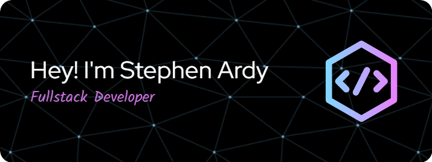

  

<h3 align="left">👩‍💻  About Me</h3>

###

<!-- 
- 🔭 I’m working as ...  -->

- 📚 I'm currently learning React Js 
<!-- - ⚡ In my free time I ...
 -->

###

<h3 align="left">🛠 Language and tools</h3>

###

  
  
  
  
  
  
  
  
  
  
  
  
  

###

<h3 align="left">🔥   My Stats :</h3>

###

  

###

  
  

###

<!-- #### 🌐 Socials:

 

#### 💻 Tech Stack:

       -->

#### 📊 GitHub Stats:

 
 

---

<!-- Proudly created with GPRM ( https://gprm.itsvg.in ) -->
